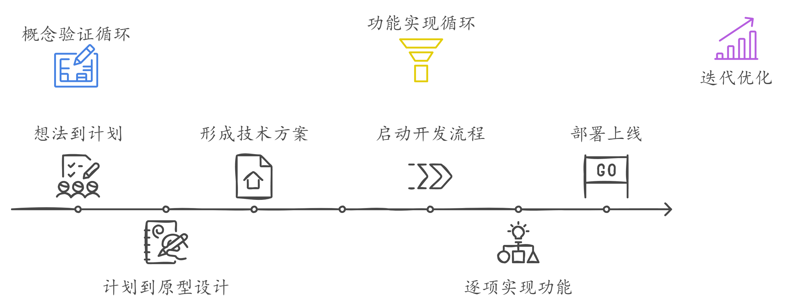

# AI Speeds Up Software Development

## 迭代结构

基于敏捷开发的嵌套双循环结构

### 概念验证循环

- 核心目标：快速验证技术方案可行性
- 主要活动：
  - 想法到计划
  - 计划到原型设计
  - 形成技术方案、开发流程、功能优先级
- 输出：1）blueprint；2）原型图
- AI工具：Claude；v0.dev 

### 功能实现循环

- 核心目标：从方案到MVP上线
- 主要活动：
  - 启动开发流程
  - 按优先级逐项实现功能
  - 部署上线（内部或外部）
- 输出：可对外展示的完整产品
- AI工具：Claude；Cursor；Replit

### 迭代优化

- 重复前两步流程，形成螺旋前进的敏捷开发模式

## AI工具Prompts

| 任务            | 工具   | Prompt                         |
| --------------- | ------ | ------------------------------ |
| 想法->计划      | Claude | [01_blueprint_prompt-claude](./01_blueprint_prompt-claude.md) |
| 计划->原型图/UI | v0.dev | [02_BP2UI_Prompt_v0](./02_BP2UI_Prompt_v0.md)         |
| 实现功能        | Claude | [03_BuildTogether_claude](./03_BuildTogether_claude.md)    |
| 实现功能        | Cursor | [04_Cursor_rules](./04_Cursor_rules.md)            |
| 部署上线        | Replit | /                              |

